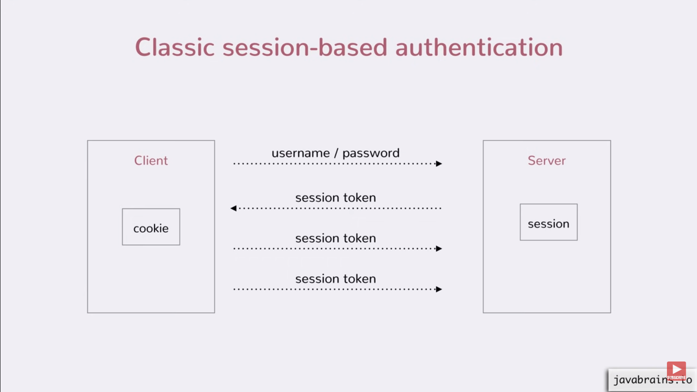

## Session Based Authentication
- HTTP is stateless. This means that each request made to the server is treated as a standalone request.
- This is where sessions come in - sessions allow the server to associate an information to a client so that when the same client sends sends a request to the server, it can get the information.
- How it works:


The learning objectives here are:
- What authentication means
- What session authentication means
- What Cookies are
- How to send Cookies
- How to parse Cookies

### Resources
- [REST API Authentication Mechanisms](https://www.youtube.com/watch?v=501dpx2IjGY)
- [HTTP Cookie](https://developer.mozilla.org/en-US/docs/Web/HTTP/Headers/Cookie)
- [Flask](https://palletsprojects.com/p/flask/)
- [Flask cookie](https://flask.palletsprojects.com/en/1.1.x/quickstart/#cookies)


## Simple API

Simple HTTP API for playing with `User` model.


### Files

#### `models/`

- `base.py`: base of all models of the API - handle serialization to file
- `user.py`: user model

#### `api/v1`

- `app.py`: entry point of the API
- `views/index.py`: basic endpoints of the API: `/status` and `/stats`
- `views/users.py`: all users endpoints


### Setup

```
$ pip3 install -r requirements.txt
```


### Run

```
$ API_HOST=0.0.0.0 API_PORT=5000 python3 -m api.v1.app
```


### Routes

- `GET /api/v1/status`: returns the status of the API
- `GET /api/v1/stats`: returns some stats of the API
- `GET /api/v1/users`: returns the list of users
- `GET /api/v1/users/:id`: returns an user based on the ID
- `GET /users/me`: retrieve the authenticated User object
- `DELETE /api/v1/users/:id`: deletes an user based on the ID
- `POST /api/v1/users`: creates a new user (JSON parameters: `email`, `password`, `last_name` (optional) and `first_name` (optional))
- `POST /api/v1/auth_session/login`: handles all routes for the Session authentication
- `PUT /api/v1/users/:id`: updates an user based on the ID (JSON parameters: `last_name` and `first_name`)
